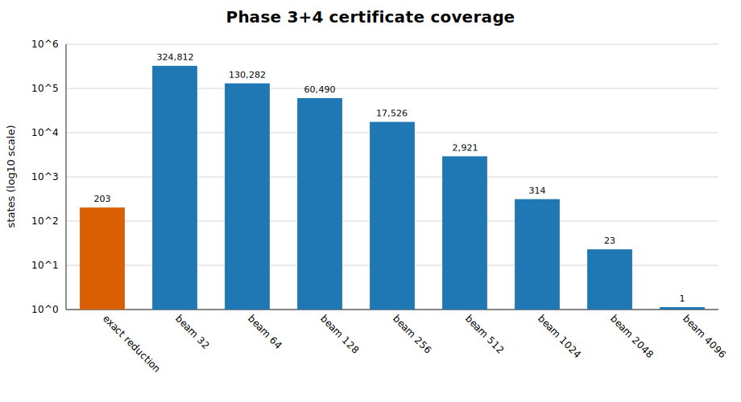

# Phases 3+4: exhaustive certificate for `D_(3+4) <= 21`

This directory contains the distributed proof certificate, the two Q-MLP
checkpoints that produced it, a portable reference replay report, and the search
statistics for the combined phase-3/phase-4 claim.

## Coordinate and exhaustive set

The metric is FTM: every non-identity power of a face turn costs one move.
The subgroup chain and left-coset convention are fixed in
[`docs/phase-definitions.md`](../docs/phase-definitions.md).

| Phase | Transition | Allowed source faces | States | Diameter | Maximal states |
|---:|---|---|---:|---:|---:|
| 3 | `G5 -> G6` | `U R F L BR BL FR` | 208,099,584 | 14 | 212 |
| 4 | `G6 -> G7` | `U R F L BR BL` | 68,400 | 8 | 2,531 |

Their maximal-layer Cartesian product has `212 * 2,531 = 536,572`
physical states. Exact boundary-window rewriting certifies 203 states without
a model. The SQLite database contains bounded words for all 536,369 remaining
states. The maximum independently replayed word length is 21.

## Coverage by discovery method



| First successful method | States | Search throughput (states/s) | Estimated full pass |
|---|---:|---:|---:|
| Exact reduction, no model | 203 | — | — |
| Beam 32 | 324,812 | 112.4 | 1 h 19 m 30 s |
| Beam 64 | 130,282 | 137.0 | 1 h 05 m 15 s |
| Beam 128 | 60,490 | 88.3 | 1 h 41 m 17 s |
| Beam 256 | 17,526 | 40.9 | 3 h 38 m 40 s |
| Beam 512 | 2,921 | 18.9 | 7 h 52 m 08 s |
| Beam 1024 | 314 | 7.2 | 20 h 39 m 47 s |
| Beam 2048 | 23 | 1.5† | 4 d 04 h 44 m† |
| Beam 4096 | 1 | 1.8† | 3 d 12 h 28 m† |

The beam width records search provenance only. It is not trusted by the proof.
Throughput is the aggregate rate for representatives actually submitted to the
model, excluding representatives already covered by an earlier cascade stage.
Measurements used an NVIDIA A100 80GB PCIe GPU with CUDA/bfloat16 inference.
The full-pass column extrapolates that rate to all 536,369 model-searched
representatives. It is a capacity estimate, not the duration of the cascading
proof run. †The last two rates are based on only 24 and one searched
representative respectively, so their extrapolations have high uncertainty.

**Observed complete model-discovery window:** 4 h 37 m 47 s from the first to
the last stored model certificate. This wall-clock interval includes the
earlier 48,463-certificate seed run and inter-process overhead, but excludes
table construction, exact reduction, and final independent replay.

## Certificate format

`certificates/beam-cascade.sqlite3.xz` expands to a SQLite database with two
tables. `metadata(key TEXT PRIMARY KEY, value TEXT)` binds the database to the
pair, FTM metric, combined problem hash, physical composition hash, remaining
ID hash, target subgroup `G7`, and limit 21.

The `certificates` table has one row per remaining representative:

| Column | Meaning |
|---|---|
| `state_id` | ID in `reductions/pair34/remaining_ids.bin` |
| `state_sha256` | hash of the 108-byte `FullStateV1` state |
| `solution` | byte-coded sequence of the 28 allowed FTM actions |
| `solution_length` | exact number of FTM moves, constrained to 0--21 |
| `beam_width` | first beam stage that found this word |
| `checkpoint_sha256`, `checkpoint_epoch` | untrusted search provenance |
| `verification_sha256` | hash binding the state, word, and proof problem |
| `created_utc` | provenance timestamp |

The checker requires the exact ID set, recomputes state hashes, and replays
every word in both the combined quotient and the independent full-state
simulator. It does not load a neural checkpoint.

## Fast integrity audit

From the repository root:

```bash
make verify-package
./phase_3_4/scripts/prepare
```

The first command streams the XZ payload, validates the uncompressed database,
queries its complete beam/checkpoint distribution, and hashes both models. The
second command installs the checked database at the ignored runtime path
`certificates/pair34/beam-cascade.sqlite3`.

## Full deterministic reproduction and replay

```bash
./phase_3_4/scripts/verify
```

This builds phases 3 and 4 from the pinned upstream source, extracts all 212
and 2,531 maximal records, composes all 536,572 physical states, regenerates
the 203 exact rewrite witnesses, and replays every direct certificate. Typical
persistent generated data is below 1 GiB; at most ten workers are used.

Successful output ends with:

```text
pair34 FULL REPRODUCTION COMPLETE
```

## Reproducing model-guided discovery

The 619,996-parameter sparse-Q MLP uses the combined `G5/G7` quotient, 28 FTM
actions, and fixed `K_max=22`. Training writes only below ignored `artifacts/`:

```bash
./phase_3_4/scripts/train \
  --device cuda:0 --amp bf16 \
  --epochs 8192 --steps-per-epoch 256 --batch-size 1024 \
  --K-min 2 --val-size 16384 --val-batch-size 2048 \
  --val-every 32 --save-every 100 --run-id reproduction
```

`models/pair34-qmlp-epoch1024.pt` produced 48,463 beam-32 certificates;
`models/pair34-qmlp-epoch1120.pt` produced the other 487,906 certificates.
The distributed files have tensor-identical weights and optimizer state, but
their four producing-machine pathname fields were replaced by repository-relative
paths. The manifest retains both original and distributed SHA-256 values; the
SQLite provenance fields refer to the distributed files.
Run `scripts/run_publication_cascade pair34` after regenerating the deterministic
phase artifacts to repeat the staged search. Any newly produced database must
still pass the independent certificate checker.

Paper: forthcoming.
